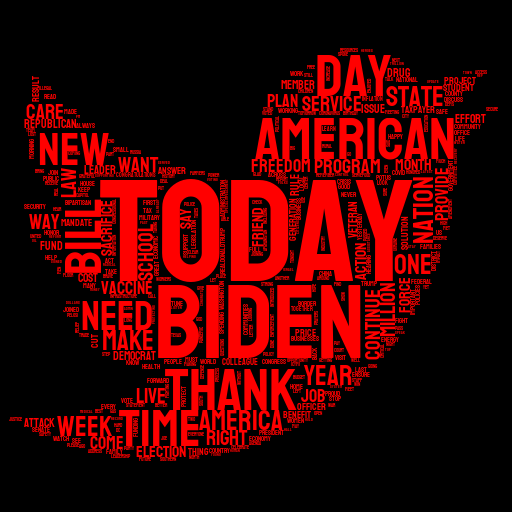

<p float="left">
  
   
</p>

# Master Thesis in Data Science - Kschool

This project aims to classify tweets between democrats or republicans from EEUU congress members.

## Description

Welcome to my project! Here you will find all the code which is needed for:  
  * 1- Download tweets from a particular user (you will need you personal tokens from [Twitter Developer Portal](https://developer.twitter.com/en)). Info from Members of Congress can be found [here](https://triagecancer.org/congressional-social-media)
  * 2- Data cleaning, data engineering and data visualizations
  * 3- NLP algorithms and conclusions  
  * 4- Frontend with streamlit to try your own tweet

In order to replicate the project, the steps are the following:

**If you are not running the code in colab, make sure you install all the dependencies listed in requirements.txt**

* 1- Execute notebook src/twitter_extractor.ipynb. **Disclimer: it will not work with twitter developer keys**
* 2- Execute notebook src/EDA.ipynb (this notebook will download an orc table, which will be used in the next notebook)
* 3- Execute notebook src/model.ipynb (make sure this notebook is reading orc table downloaded in the previous step)
* 4- In order to use the frontend visualization, donwload the repository to local, then execute the following steps in the cli (linux):
```
cd twitter-category-nlp/frontend/
streamlit run app.py
```
  
## Tree
│───data  
│  
│───frontend  
│  
│───imgs  
│  
│───model  
│  
├───src  
│   ├──   model.ipynb  
│   ├── EDA.ipynb  
│   ├── twitter_extractor.ipynb  
│   
│   
│   .gitignore  
│   CHANGELOG.MD  
│   README.md  
│   requirements.txt  
